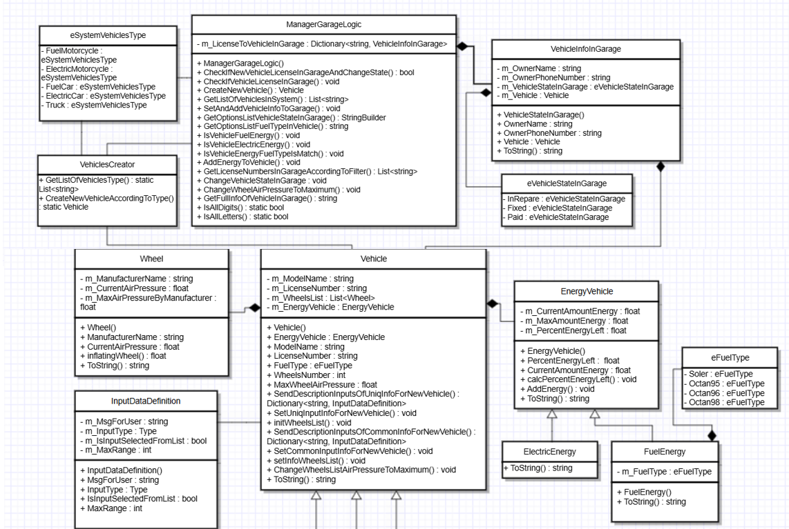
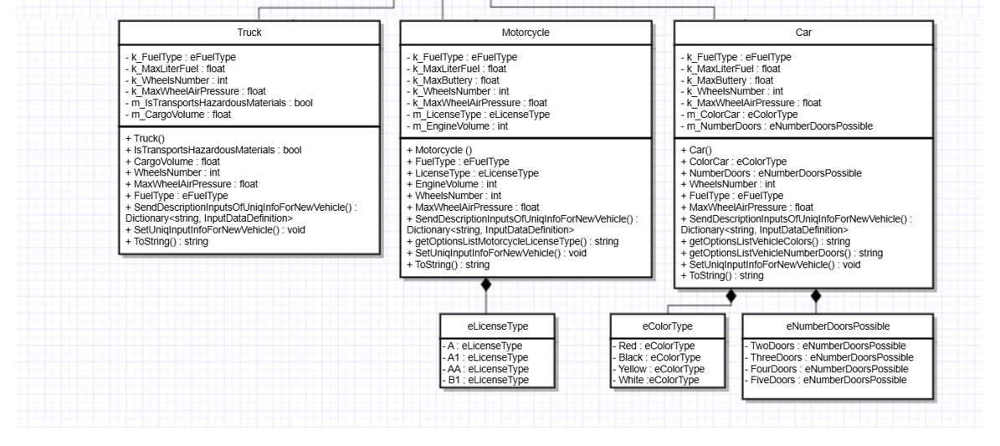

# Console Application - Garage

## Overview
This console application is developed in C# and implements a garage management system. The application is designed to compartmentalize the logic of the system and the UI interface, allowing for further development of additional interfaces. It utilizes Object-Oriented Programming (OOP) principles.

## Features
- **Customer Management:** Manage customers in the garage.
- **Car Condition Tracking:** Track the status of the car's condition before and after service.
- **Extensibility:** Easily add new interfaces and functionalities due to its modular design.

A brief explanation of the system and its classes is attached in the system classes.docx.

## Diagram
A diagram explaining the relationship between the classes:

